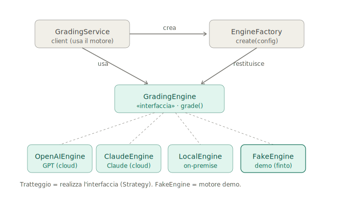

# Architettura dei motori

### Strategy + Factory, motore demo e identità nell'audit

> **Ambito.** Pattern di progettazione dello strato che astrae i motori di correzione. Si aggancia a [`governanceModelli.md`](./governanceModelli.md) (certificazione e qualità dei motori) e a [`ruoliEPermessi.md`](./ruoliEPermessi.md) (audit trail e versioning del voto).

---

## 1. Il pattern portante è lo Strategy, non la Factory

Sono due pattern che lavorano insieme con ruoli diversi, e il primo è quello che regge l'intera idea "demo = motore finto":

- **Strategy** — un'unica interfaccia `GradingEngine.grade(elaborato, griglia) → Risultato` e tante implementazioni intercambiabili usate in modo polimorfico (OpenAI, Claude, open-source on-prem, e il `FakeEngine` della demo). Il resto del sistema non sa né gli importa quale strategia stia girando.
- **Factory** — il complemento che *istanzia/seleziona* la strategia giusta a partire dalla configurazione (il motore scelto dal tenant, il flag demo, o l'iterazione del benchmark su più motori). Basta una Factory Method / Factory parametrica: `EngineFactory.create(config) → GradingEngine`.

La demo non richiede infrastruttura nuova: il `FakeEngine` è semplicemente un'implementazione in più dietro la stessa interfaccia che già serve per il multi-motore.

---

## 1-bis. Registry multi-motore da subito, catalogo certificato dopo: tre livelli distinti

"Il multi-motore arriva alla Fase 3" vale per la **feature di prodotto**, non per il **meccanismo**. Vanno tenuti separati tre livelli con scadenze diverse, per non sotto-dimensionare la Factory a "un fake + un placeholder":

1. **Meccanismo multi-motore (registry) — subito.** La Factory tiene un *insieme* di N implementazioni dietro la stessa interfaccia e ne istanzia/itera una. Lo pretende la demo (il `FakeEngine`) *e*, soprattutto, il benchmark cross-family di Fase 0, che per definizione fa girare **più motori sullo stesso corpus** per confrontarli (vedi [`roadmap.md`](./roadmap.md) §4–5). Non si "provano i motori" senza istanziarne parecchi in modo intercambiabile.
2. **Motori frontier non certificati su dati sintetici — Fase 0.** Nel registry ci girano i motori frontier per la misura (ICC, QWK, SMD), non ancora certificati. È lecito perché il confine di compliance è *dati sintetici vs dati reali*, non il numero di motori: su sintetico i motori extra-UE si usano liberamente (gate di migrazione in [`roadmap.md`](./roadmap.md) §4).
3. **Catalogo certificato + scelta del motore come value prop — Fase 3.** Set di motori certificati, profilo pubblicato, selezione da parte del tenant. È qui che il multi-motore diventa *feature*, e resta tardi di proposito perché a basso rischio.

La regola operativa: la Factory nasce già capace di reggere più motori (livello 1); ciò che si aggiunge dopo è la *certificazione* e la *superficie di prodotto* (livelli 2–3), non il meccanismo.

---

## 2. Il disegno

*Tratteggio = realizza l'interfaccia (Strategy). `FakeEngine` = motore demo.*

---

## 3. Abstract Factory? Non adesso

L'Abstract Factory serve a creare *famiglie di oggetti correlati che variano insieme* e devono restare coerenti (il classico esempio è il toolkit UI che produce Button + Checkbox + Scrollbar abbinati a un tema). Qui c'è **un solo tipo di prodotto** — il motore — con più varianti: è il caso della Factory semplice.

Diventa giustificata **solo se** ogni motore si porta dietro una famiglia di collaboratori che devono combaciare — per esempio un `PromptAdapter` + un `ResponseParser` + un tokenizer specifici per famiglia. Dato che in `governanceModelli.md` è annotato il *tuning di prompt e formato per motore*, è uno scenario che potrebbe emergere. La regola: partire da **Strategy + Factory semplice**, promuovere ad Abstract Factory se e quando quei collaboratori diventano una famiglia coerente. Non prima (YAGNI — *You Aren't Gonna Need It*: non costruire in anticipo ciò che non serve ancora).

---

## 4. Il FakeEngine è anche un test double

Il motore finto non serve solo alla demo:

- È un **test double** deterministico e a costo zero (nessuna chiamata API): rende l'intera pipeline di correzione testabile in automatico.
- È una **cartina di tornasole dell'astrazione**: se riesci a sostituirlo senza che il resto del sistema se ne accorga, il *seam* dell'interfaccia è pulito.
- Lo stesso oggetto serve quindi demo, test e verifica del design.

---

## 5. Regola di identità del motore nell'audit

Il `FakeEngine` deve dichiarare un `engine id/version` riconoscibile (es. `demo-fake`) nell'audit trail, così un voto prodotto in demo non può **mai** essere scambiato per un voto di un motore certificato. Il versioning che già congela la terna *compito + griglia + motore/versione* (vedi `ruoliEPermessi.md`) lo gestisce in automatico — basta che il motore finto non menta sulla propria identità.

---

## 6. Disciplina del contratto di output

Pretendere che fake e reale siano davvero intercambiabili costringe a definire bene il **contratto di output** — punteggi per tratto + feedback + metadati (motore, versione). È la stessa disciplina che serve poi ai motori veri, quindi il `FakeEngine` la impone gratis fin dal primo giorno.

---

## 7. Sintesi

Strategy regge l'intercambiabilità dei motori (compreso quello demo); la Factory ne sceglie l'istanza; l'Abstract Factory resta in riserva per quando i collaboratori per-motore diventeranno una famiglia. Il `FakeEngine` è insieme motore demo, test double e verifica dell'astrazione — a patto che dichiari onestamente la propria identità nell'audit.
